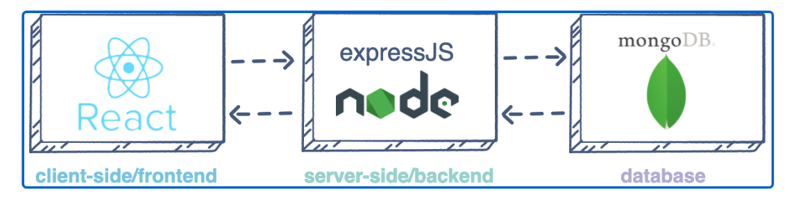

## **MERN_STACK IMPLEMENTATION**
---
---

MERN stack consist of the following stacks, MongoDB, ExpressJS, ReactJS and NODEJS.

1. MongoDB: A document-based, No-SQL database used to store application data in a form of documents.
2. MongoDB: A document-based, No-SQL database used to store application data in a form of documents.
3. ReactJS: A frontend framework developed by Facebook. It is based on JavaScript, used to build User Interface (UI) components.
4. Node.js: A JavaScript runtime environment. It is used to run JavaScript on a machine rather than in a browser.



Here as others, we will follow the steps below.

### **1. BACKEND CONFIGURATION**

- Update Ubuntu by running the code below

    `sudo apt update`

- Next, upgrade ubuntu by running the code below

    `sudo apt upgrade`

- Lets get the location of Node.js software from ubuntu repository using [NodeSource](https://github.com/nodesource/distributions/blob/master/README.md) 

    `curl -fsSL https://deb.nodesource.com/setup_18.x | sudo -E bash - `

- Install Node.js on the server

    `sudo apt-get install -y nodejs`

- The command above installs both nodejs and npm. NPM is a package manager for Node like apt for Ubuntu

- You can check the version of the nodejs and npm by running the code below.

    `npm -v and node -v`

- Next we make a folder called Todo and cd into it.

    `cd Todo`

- Next, we will use the command npm init to initialize our project, so that a new file named package.json will be created. This file will normally contain information about our application and the dependencies that it needs to runs.

    `npm init`

### **1a. INSTALL EXPRESSJS**

Express is a framework for Node.js, therefore a lot of things developers would have programmed is already taken care of out of the box. Therefore it simplifies development, and abstracts a lot of low level details.

- To use express we have to install it using npm

    `npm install express`

- Next we create a file index.js with the code below.

    `touch index.js`

- Next install dotenv for environmental variable

    `npm install dotenv`

- Then we open the index.js in vim and paste the below code into it.

```
const express = require('express');
require('dotenv').config();

const app = express();

const port = process.env.PORT || 5000;

app.use((req, res, next) => {
res.header("Access-Control-Allow-Origin", "\*");
res.header("Access-Control-Allow-Headers", "Origin, X-Requested-With, Content-Type, Accept");
next();
});

app.use((req, res, next) => {
res.send('Welcome to Express');
});

app.listen(port, () => {
console.log(`Server running on port ${port}`)
});
```

- Now save and exit vim

- Now run the below code to start the server.

    `node index.js`


- Now we need to open this port (5000) in EC2 Security Group as shown below.


- Open up your browser and try to access your server’s Public IP 

    `http://<public-IP-address>:5000`

- There are three actions that our To-Do application needs to be able to do:

1. Create a new task
2. Display list of all tasks
3. Delete a completed task

- First we make a folder for our routes

    `mkdir routes`

- Then we cd into our folder routes and create a file api.js

    `cd routes and touch api.js`

- Open the file api.js and paste the below code.

```
const express = require ('express');
const router = express.Router();

router.get('/todos', (req, res, next) => {

});

router.post('/todos', (req, res, next) => {

});

router.delete('/todos/:id', (req, res, next) => {

})

module.exports = router;
```
### **1b. MODELS**

A model is at the heart of JavaScript based applications, and it is what makes it interactive. We will use models to define the database schema. This is important so that we will be able to define the fields stored in each Mongodb document.

- To create a schema and model, we need to install mongoose which is a nodejs package that makes working with mongodb easy.

- Change directory into the Todo folder

    `cd ..`
    
    `npm install mongoose`

- create a folder models

    `mkdir models`

- change directory into the newly created models

    `cd models`

- Inside the models folder, create a file and name it todo.js

    `touch todo.js`

- All three commands above can be defined in one line to be executed consequently with help of && operator as shown below.

    `mkdir models && cd models && touch todo.js`

- Open the file created with vim todo.js then paste the code below 

```
const mongoose = require('mongoose');
const Schema = mongoose.Schema;

//create schema for todo
const TodoSchema = new Schema({
action: {
type: String,
required: [true, 'The todo text field is required']
}
})

//create model for todo
const Todo = mongoose.model('todo', TodoSchema);

module.exports = Todo;
```

- Now we need to update our routes from the file api.js in ‘routes’ directory to make use of the new model.

- In Routes directory, open api.js with vim api.js, delete the code inside with `:%d` command and paste there code below into it then save and exit

```
const express = require ('express');
const router = express.Router();
const Todo = require('../models/todo');

router.get('/todos', (req, res, next) => {

//this will return all the data, exposing only the id and action field to the client
Todo.find({}, 'action')
.then(data => res.json(data))
.catch(next)
});

router.post('/todos', (req, res, next) => {
if(req.body.action){
Todo.create(req.body)
.then(data => res.json(data))
.catch(next)
}else {
res.json({
error: "The input field is empty"
})
}
});

router.delete('/todos/:id', (req, res, next) => {
Todo.findOneAndDelete({"_id": req.params.id})
.then(data => res.json(data))
.catch(next)
})

module.exports = router;
```

### **1c. MONGODB DATABASE**

We need a database where we will store our data. For this we will make use of mLab. mLab provides MongoDB database as a service solution [DBaaS](https://en.wikipedia.org/wiki/Cloud_database), so to make life easy, you will need to sign up for a shared clusters free account, which is ideal for our use case. [sign up here](https://www.mongodb.com/atlas-signup-from-mlab)

- You can [set up mongodb atlas here](https://www.mongodb.com/docs/atlas/getting-started/) .

- After the setup we will need the connection URL as shown below.


- In the index.js file, we specified process.env to access environment variables, but we have not yet created this file. So we need to do that 

- Create a file in your Todo directory and name it .env.

    `touch .env && vi .env`

- We need to update the index.js to reflect the use of .env so that Node.js can connect to the database

    `vim index.js`

```
const express = require('express');
const bodyParser = require('body-parser');
const mongoose = require('mongoose');
const routes = require('./routes/api');
const path = require('path');
require('dotenv').config();

const app = express();

const port = process.env.PORT || 5000;

//connect to the database
mongoose.connect(process.env.DB, { useNewUrlParser: true, useUnifiedTopology: true })
.then(() => console.log(`Database connected successfully`))
.catch(err => console.log(err));

//since mongoose promise is depreciated, we overide it with node's promise
mongoose.Promise = global.Promise;

app.use((req, res, next) => {
res.header("Access-Control-Allow-Origin", "\*");
res.header("Access-Control-Allow-Headers", "Origin, X-Requested-With, Content-Type, Accept");
next();
});

app.use(bodyParser.json());

app.use('/api', routes);

app.use((err, req, res, next) => {
console.log(err);
next();
});

app.listen(port, () => {
console.log(`Server running on port ${port}`)
});
```

- You can start the server using the command below

    `node index.js`

- Next we will use POSTMAN to test our end points or routes


- We also ran API test for get, and delete.

### **1. FRONTEND CONFIGURATION**

Since we are done with the functionality we want from our backend and API, it is time to create a user interface for a Web client (browser) to interact with the application via API. To start out with the frontend of the To-do app, we will use the create-react-app command to scaffold our app.

- In the same root directory as your backend code, which is the Todo directory, run below code

    `npm create-react-app client`

- Before testing the react app, there are some dependencies that need to be installed

    1. Install concurrently. It is used to run more than one command simultaneously from the same terminal window.

    `npm install concurrently --save-dev`

    2. Install nodemon. It is used to run and monitor the server. If there is any change in the server code, nodemon will restart it automatically and load the new changes.

    `npm install nodemon --save-dev`

    3. In Todo folder open the package.json file. Change the highlighted part of the below screenshot and replace with the code below.

```
    "scripts": {
"start": "node index.js",
"start-watch": "nodemon index.js",
"dev": "concurrently \"npm run start-watch\" \"cd client && npm start\""
            }
```
- Next we configure Proxy in package.json

    1. change the directory to client

        `cd client`

    2. Open the package.json file

        `vi package.json`

    3. Add the key value pair in the package.json file "proxy": "http://localhost:3000".

    ```
    The whole purpose of adding the proxy configuration in number 3 above is to make it possible to access the application directly from the browser by simply calling the server url like http://localhost:5000 rather than always including the entire path like http://localhost:5000/api/todos
    ```

    - ensure you are inside the Todo directory, and simply do the below

        `npm run dev`

    - Your app should open and start running on localhost:3000

- One of the advantages of react is that it makes use of components, which are reusable and also makes code modular. For our Todo app, there will be two stateful components and one stateless component.

- From our Todo directory run

    `cd client`

- Move to the src directory

    `cd src`

- Inside your src folder create another folder called components

    `mkdir components`

- Move into the components directory with

    `cd components`

- Inside ‘components’ directory create three files Input.js, ListTodo.js and Todo.js.

    `touch Input.js ListTodo.js Todo.js`

- Open input.js file

    `vi input.js`

- Copy and paste the following
 
```
import React, { Component } from 'react';
import axios from 'axios';

class Input extends Component {

state = {
action: ""
}

addTodo = () => {
const task = {action: this.state.action}

    if(task.action && task.action.length > 0){
      axios.post('/api/todos', task)
        .then(res => {
          if(res.data){
            this.props.getTodos();
            this.setState({action: ""})
          }
        })
        .catch(err => console.log(err))
    }else {
      console.log('input field required')
    }

}

handleChange = (e) => {
this.setState({
action: e.target.value
})
}

render() {
let { action } = this.state;
return (
<div>
<input type="text" onChange={this.handleChange} value={action} />
<button onClick={this.addTodo}>add todo</button>
</div>
)
}
}

export default Input
```

- To make use of Axios, which is a Promise based HTTP client for the browser and node.js, you need to cd into your client from your terminal and run yarn add axios or npm install axios.

- Move to the src folder

    `cd ..`

- Move to the client folder

    `cd ..`

- Install Axios

    `npm install axios`

- To finish up the front end application we will go to component directory as shown in the codes below.

    `cd src/components`

    `vi ListTodo.js`

- In the ListTodo.js copy and paste the following code

```
import React from 'react';

const ListTodo = ({ todos, deleteTodo }) => {

return (
<ul>
{
todos &&
todos.length > 0 ?
(
todos.map(todo => {
return (
<li key={todo._id} onClick={() => deleteTodo(todo._id)}>{todo.action}</li>
)
})
)
:
(
<li>No todo(s) left</li>
)
}
</ul>
)
}

export default ListTodo
```

- Then in your Todo.js file you write the following code

```
import React, {Component} from 'react';
import axios from 'axios';

import Input from './Input';
import ListTodo from './ListTodo';

class Todo extends Component {

state = {
todos: []
}

componentDidMount(){
this.getTodos();
}

getTodos = () => {
axios.get('/api/todos')
.then(res => {
if(res.data){
this.setState({
todos: res.data
})
}
})
.catch(err => console.log(err))
}

deleteTodo = (id) => {

    axios.delete(`/api/todos/${id}`)
      .then(res => {
        if(res.data){
          this.getTodos()
        }
      })
      .catch(err => console.log(err))

}

render() {
let { todos } = this.state;

    return(
      <div>
        <h1>My Todo(s)</h1>
        <Input getTodos={this.getTodos}/>
        <ListTodo todos={todos} deleteTodo={this.deleteTodo}/>
      </div>
    )

}
}

export default Todo;
```

- We need to make little adjustment to our react code. Delete the logo and adjust our App.js to look like this.


- Move to the source folder and run the below code

    `vi App.js`

- Copy and paste the code below into it

```
import React from 'react';

import Todo from './components/Todo';
import './App.css';

const App = () => {
return (
<div className="App">
<Todo />
</div>
);
}

export default App;
```

- After pasting, exit the editor. In the src directory open the App.css

    `vi App.css`

- Then paste the following code into App.css:

```
.App {
text-align: center;
font-size: calc(10px + 2vmin);
width: 60%;
margin-left: auto;
margin-right: auto;
}

input {
height: 40px;
width: 50%;
border: none;
border-bottom: 2px #101113 solid;
background: none;
font-size: 1.5rem;
color: #787a80;
}

input:focus {
outline: none;
}

button {
width: 25%;
height: 45px;
border: none;
margin-left: 10px;
font-size: 25px;
background: #101113;
border-radius: 5px;
color: #787a80;
cursor: pointer;
}

button:focus {
outline: none;
}

ul {
list-style: none;
text-align: left;
padding: 15px;
background: #171a1f;
border-radius: 5px;
}

li {
padding: 15px;
font-size: 1.5rem;
margin-bottom: 15px;
background: #282c34;
border-radius: 5px;
overflow-wrap: break-word;
cursor: pointer;
}

@media only screen and (min-width: 300px) {
.App {
width: 80%;
}

input {
width: 100%
}

button {
width: 100%;
margin-top: 15px;
margin-left: 0;
}
}

@media only screen and (min-width: 640px) {
.App {
width: 60%;
}

input {
width: 50%;
}

button {
width: 30%;
margin-left: 10px;
margin-top: 0;
}
}
```

- Please always remember to save and exit the vim editor

- In the src directory open the index.css

    `vim index.css`

- Copy and paste the code below:

```
body {
margin: 0;
padding: 0;
font-family: -apple-system, BlinkMacSystemFont, "Segoe UI", "Roboto", "Oxygen",
"Ubuntu", "Cantarell", "Fira Sans", "Droid Sans", "Helvetica Neue",
sans-serif;
-webkit-font-smoothing: antialiased;
-moz-osx-font-smoothing: grayscale;
box-sizing: border-box;
background-color: #282c34;
color: #787a80;
}

code {
font-family: source-code-pro, Menlo, Monaco, Consolas, "Courier New",
monospace;
}
```

- Go to the Todo directory

    `cd ../..`

- npm run dev


- The image above show the todo web application lined to the Nodejs server